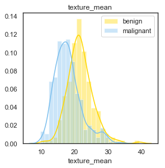
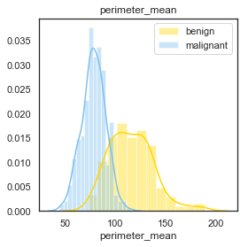
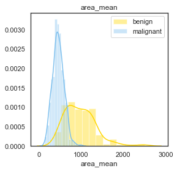
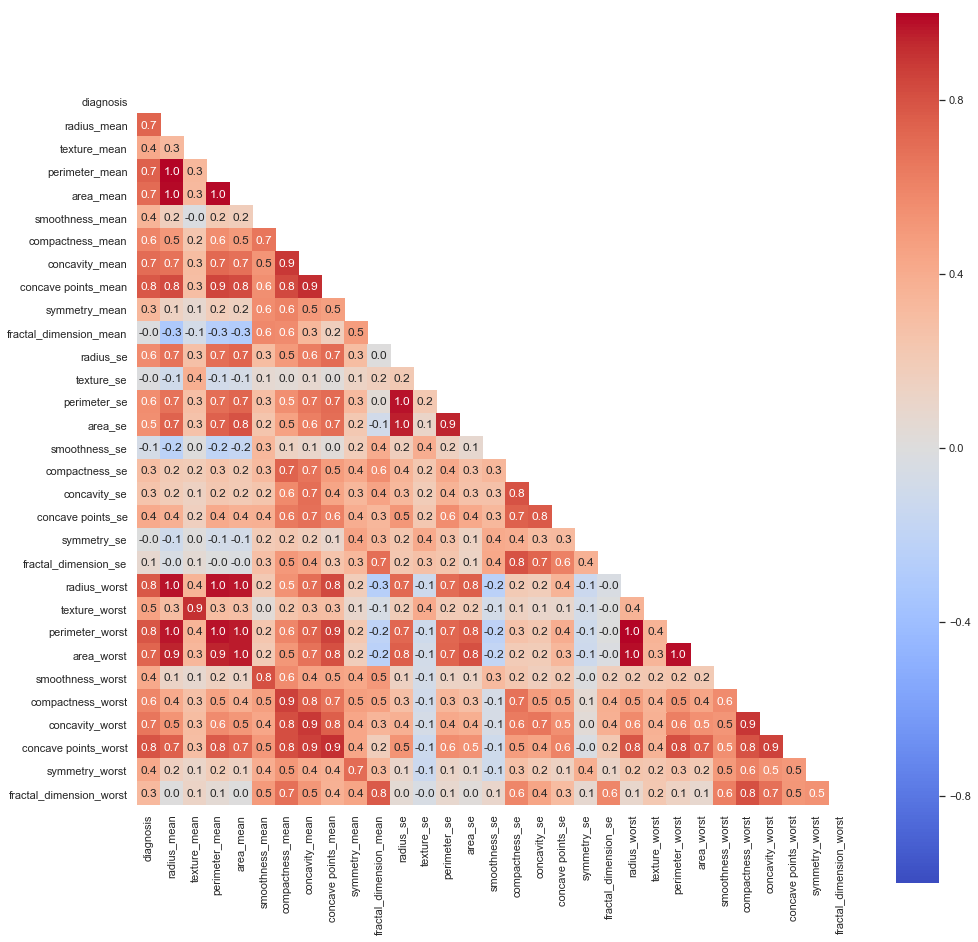
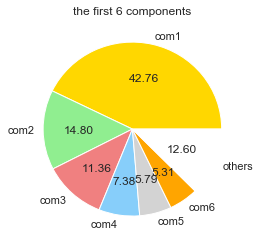
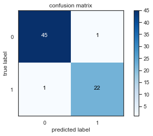
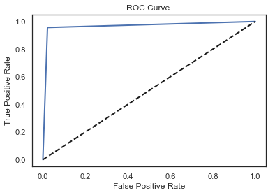

# Breast Cancer Analysis
###### Author - Ayush Sharma 

Predicting breast cancer based on various atributes caputred in the breast images

# Introduction to Topic
Breast cancer is cancer that forms in the cells of the breasts.After skin cancer, breast cancer is the most common cancer diagnosed in women in the United States. Breast cancer can occur in both men and women, but it's far more common in women.

# Diagnosis
A breast fine needle aspiration (FNA) removes some fluid or cells from a breast lesion (a cyst, lump, sore or swelling) with a fine needle similar to that used for blood tests. The sample of fluid or cells (or tissue) is examined by a specialist doctor

# About the Data
Features are computed from a digitized image of a fine needle aspirate (FNA) of a breast mass.  They describe characteristics of the cell nuclei present in the image.

# Features Importance
Under a microscope, normal cells and cancer cells may look quite different. In contrast to normal cells, cancer cells often exhibit much more variability in cell size – some are larger than normal and some are smaller than normal. In addition, cancer cells often have an abnormal shape, both of the cell, and of the nucleus (the “brain” of the cell.) The nucleus appears both larger and darker than normal cells.

# Dataset

The dataset consists of various attributes of the Diagnosed cell. 

 Visualization the distribution of the output variable among the dataset.

The distribution is in the ratio 60 to 40 for the variable. The accuracy for the M class of output variable might be high as compared to B class since the number of observation are fewer for B as compared to M.

# The Attributes characteristics for both the classes of output variable for classification 

The texture_mean  attributes has significant overlap as compared to other attributes hence its not a good variable for classification.

# Correlation Matrix

Some of the attributes has high correlation and hence we will be using PCA in order to deal with high correlation and reduce dimensionality.

# Using PCA and the components explain the Variance in the dataset.

The first component explains the maximum variability of the dataset as compared to the other components.

# Confusion Matrix

The accuracy of the model is good and the misclassification rate is  fairly low for both the classes of  output variable.

# ROC Curve

